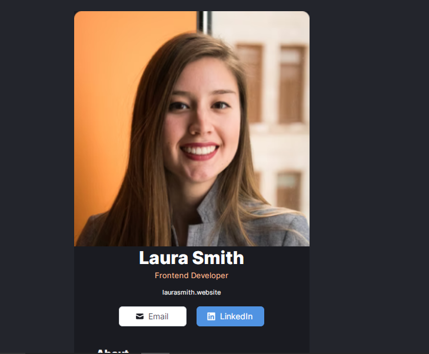
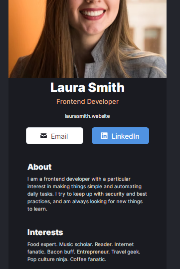

# This is my first project in React

This is a solution to the [Practice Projec in 'Learn React for free' by Scrimba](https://scrimba.com/learn/learnreact). 

## Table of contents

- [Overview](#overview)
  - [The challenge](#the-challenge)
  - [Screenshot](#screenshot)
  - [Links](#links)
- [My process](#my-process)
  - [Built with](#built-with)
  - [Author](#author)

## Overview

### The challenge

Users should be able to:

- View the optimal layout for the app depending on their device's screen size

### Screenshot

### Links

- Solution URL: (https://github.com/Kaushaljoshi29/Scrimba-Business-Card-Master)
- Live Site URL: (https://kaushaljoshi29.github.io/interactive-rating-component-main/)

## My process

### Built with

- Semantic HTML5 markup
- CSS3
- Flexbox
- React

## Author

- Github - [@Kaushaljoshi29](https://github.com/Kaushaljoshi29?tab=repositories)
